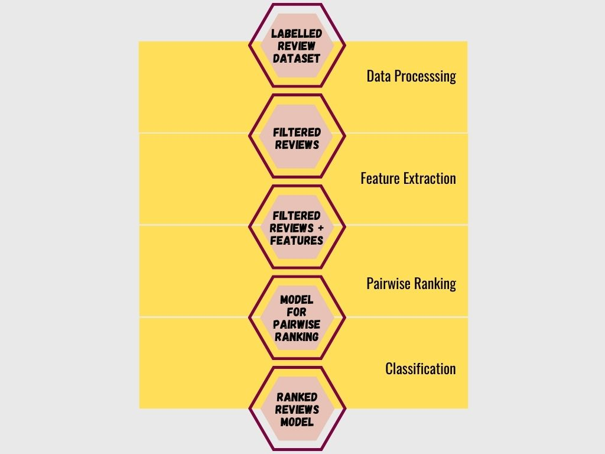

# E-commerce-product-review-analysis

## Problem Statement
This project analyzes a dataset containing e-commerce product reviews. The goal is to use machine learning models to perform sentiment analysis on product reviews and rank them based on relevance. Reviews play a key role in product recommendation systems.

## Executive Summary
How do reviews help?
* Improves credibility of the platform
* Boosts sale of products
* Helps customers decide whether to buy a product or not
* Increases session time of a customer on the platform
* Improves SEO ranking on Google Search

## Methodology

First of all, the data was cleaned by removing things like non-english words, gibberish and profanities. 

New features were added through feature engineering, some of which being features like polarity score, compound score, review length, review complexity, etc.

Then pairwise ranking was carried out on the reviews to ensure that the reviews labelled as informative were at the top, to enable visibility to customers.

Finally three models: Logistic Regression, Decision Trees and Random Forest were used to classify the reviews. 

Logistic Regression Model:
* Accuracy Score - 85%
* F1-Score - 85%

Decision Tree Model:
* Accuracy - 98%
* F1-Score - 98%

Random Forest Model:
* Accuracy Score - 99%
* F1-Score - 99%

## Conclusion
The Decision Tree model as well as the Random Forest model performed well with the Random Forest model performing a percentage better.

The model can be used to classify reviews which have labels(informative/uninformative) and which have no labels.

